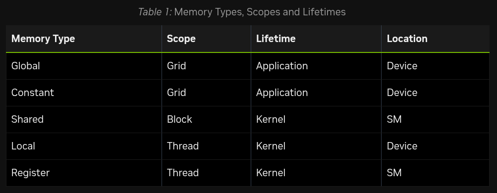

# Day 1

Cuda Computing:
Solves problems in parallel to increase the speed of computation. <br>
- Use cases: 
    - Ray tracing
    - Video processing
    - Optmize matrix multiplication in Neural Networks.


- Memory bandwidth is the major bottleneck. But why??? (we'll figure it out later).
- Tried Installing cuda, version mismatch between nvidia driver's cuda dependency and installed cuda version. Tried installing cuda12.9 to match nvidia driver. 
- Tried running hello world cuda c++ program on google colab. (Worked)
- Process: <br>
    1. Code in `hello.cu` file.
    2. Run following command in code block while selecting a GPU Runtime(T4 GPU) in free tier.
        ```
        !nvcc -arch=sm_75 hello.cu -o hello
        !./hello
        ```

# Day 2


- Successfully installed resolved cuda installation issues in local setup. 

## Cuda Programming model. 
https://docs.nvidia.com/cuda/cuda-programming-guide/01-introduction/programming-model.html#heterogeneous-systems


**Device Code**: Code that executes on GPU. 
- Kernel: The function that is invoked for execution in GPU. 
- Launching the kernel: Act of starting a kernel 

- Similar to launching multiple threads in CPU, is launching kernel in GPU. 

- A GPU -> Collection of GPC(Graphics Processing Cluster)s connected to the GPU memory - Collection of SM(Streaming Multiprocessors) -> 

- A kernel execution spawns millions of threads. Threads are organized into blocks called thread blocks which are organized in grid. 

- Threads within a thread block all have access to the on-chip shared memory, which can be used for exchanging information between threads of a thread block.
- Cuda programming requires that it is possible to execute thread blocks in any order, in parallel or series.

- Thread Block Clusters(Optional Grouping):  Are a group of thread blocks, which together form a grid. 
Can be laid out in 1,2,3 dimensions similar to thread block and grid. 

- Same cluster, processed simulataneously in different SMs within the same GPC. 

## Warps and SIMT
The threads in a thread block are organized into a group of 32 threads called warps. 
A warp executes the kernel in SIMT (Single Instruction Multiple Threads) paradigm. 

All threads in the warp execute the same instruction simultaneously. If threads within a warp, don't follow a control flow branch in execution, they are masked off
while others are executed. 


Thread blocks are best specified to be in multiples of 32. Otherwise, the final warp will have some lanes unused for most of execution resulting in sub-optimal functional unit utilization. 

SIMT(Single Instruction Multiple Threads) is often compared with SIMD(Single Instruction Multiple Data) model of parallelism. 


!! Understanding warp execution model is helpful in understanding: Global Memory Coalescing and Share Memory Bank Access Patterns


## GPU Memory and DRAM in heterogeneous systems. 
DRAM attached to GPU is called global memory as it's accessible to all SMs. 
DRAM atached to CPU is called system or host memory. 

- heterogeneous systems use virutal memory addressing. Both CPU and GPU use a single unified memory space. So given a memory address, it's 
possible to determine which GPU or CPU the address is associated with. 


## On-Chip Memory in GPUS
- In addition to global memory, each SM has their own register file, shared memory and L1 cache.  
- Quick access to threads on same SM but inaccesssible to other threads. 
- Register allocation is per thread, while shared memory is common to each thread block. 

## Caches
- Each SM has their own L1 cache
- A larger L2 cache is shared by all SMs in a GPU. 


## Unified Memory
- Allocated memory is accessible to that device only. 
- By using unified memory, CUDA relocates or enables access. 
- Even with unified memory, accessing from memory where it resides provides optimal performance. 

- **CUDA Dynamic Parallelism** => A thread block may be suspended to memory. 
- **Mapped Memory** => CPU memory allocated with properties that enable direct access from GPU. 


# Cuda Platform
PTX(Parallel Thread Execution): High level assembly language for NVIDIA GPUs. 
NVCC(NVIDIA CUDA Compiler)


## Cubins and Fatbins
- C++ code is compiled to PTX which is then converted to binary code for execution which is CUDA binary or cubin.  
- A cubin has specific binary format for a specific SM version eg: sm_120. 
- GPU code is stored in fatbin. Fatbins contains cubin and PTX for multiple versions of SMs.  

======================================================================
# Day 3

## Programming GPUs in CUDA
https://docs.nvidia.com/cuda/cuda-programming-guide/02-basics/intro-to-cuda-cpp.html


### Kernel 
- Code is specified using `__global__` declaration specifier. 
- Kernel Launch is a operation, that starts a kernel running. A kernel has a void return type. 

```
__global__ void vecAdd(float* A, float* B, float* C){

}

```
- The number of threads that a kernel will execute is specified during kernel launch. 
- The execution configuration during kernel launch is specified under triple chevron (`<<< >>>`)

eg: 
```
__global__ void vecAdd(float* A, float* B, float* C){

}

int main(){
    ...
    // Kernel Invocation
    vecAdd<<<1, 256>>>(A,B,C);
    ...

    // first_param = grid dimension, second_param = thread block dimension. 
}
```

### Asynchronous Kernel Launches
- Kernel launches are asynchronous and the host doesn't wait for the end or even start of kernel in the GPU. So, some form of synchronization is required. 
- The most basic form being, synchronizing the entire GPU. 

- When using 2 or 3 dimensional grids or thread blocks, `dim3` is used as the dimension parameter. 

```
int main(){
    ...
    dim3 grid(16,16);
    dim3 block(8,8);
    MatAdd<<<grid, block>>>(A,B,C);
    ...
}
```

## Thread and Grid Index Intrinsics
1. `gridDim` : Dimension of the grid, as specified in execution configuration. 
2. `blockDim` : Dimension of the thread block, as specified in execution configuration. 
3. `threadIdx`: gives the index of thread, within it's thread block. Each thread in a thread block has different index. 
4. `blockIdx` : Gives the index of the thread block within the grid. Each thread block will have a different index. 

Each of these intrinsics have a `.x`, `.y` and `.z` member. Dimension not specified by launch configuration is set to 1. `threadIdx` and `blockIdx` are zero indexed. 
- `threadIdx.x` will take values from 0 to `blockDim.x-1`. and so on for other dimensions. 
- `blockIdx.x` will take values from 0 to `gridDim.x-1`. 


```
__global__ void vecAdd(float* A, float* B, float* C){
    int workIndex = threadIdx.x + blockDim.x * blockIdx.x;

    C[workIndex] = A[workIndex] + B[workIndex];
}

int main(){
    ...
    // A,B,C are vectors with 1024 elements. 
    vecAdd<<<4, 256>>>(A,B,C);
    ...
}
```

Here, 4 blocks of 256 threads each are used to calcuate. Each calculation happens at a unique workIndex. 

- **First thread block**:  blockIdx.x = 0, so => workIndex = threadIdx.x
- **Second thread block**: blockIdx.x =1, so => workIndex = threadIdx.x + 256*1 
- **Third thread block**:  blockIdx.x = 2, so => workIndex = threadIdx.x + 256*2 


# Day 4
## Bounds Checking
The above code assumes that vector is of the dimension which is multiple of thread block size. (256 in this case)
To make kernel handle any vector length, we add checks -> A thread block is launched with some inactive threads to resolve this. 

```
__global__ void vecAdd(float* A, float* B, float* C, int vectorLength){
    int workIndex = threadIdx.x + blockDim.x * blockIdx.x;

    if (workIndex < vectorLength){
        <!-- Perform Computation -->
        C[workIndex] = A[workIndex] + B[workIndex];
    }
}

```

- Launching thread block with few threads that do no work, don't incur a large overhead cost. But thread blocks where no thread performs any work must be avoided.

$$
\text{Number of thread blocks}=\frac{\text{Threads required}}{\text{Number of Threads Per Block}}$$
Rounded to the ceiling value. 

    ```
    // vectorLength is number of items in the vector.
    int threads = 256;
    int blocks = (vectorLength + threads - 1)/threads;  // behaves like a ceiling function
    vecAdd<<<blocks,threads>>>(devA, devB, devC, vectorLength);
    ```

Alternatively, this ceil division can be done by using `cuda::ceil_div` included in `<cuda/cmath>` header in `nvcc` compiler. 

    ```
    int threads = 256;
    int blocks= cuda::ceil_div(vectorLength, threads);
    vecAdd<<<blocks,threads>>>(devA, devB, devC, vectorLength);
    ```


## Memory in GPU Computing
In above examples, `A`, `B`, `C` must be in memory accessible to the GPU. But how? 


### Unified Memory
Unified memory is a feature of cuda runtime that lets NVIDIA driver manage movement of data between host and devices. Memory is allocated using `cudaMallocManaged` API or with `__managed__` specifier. 

Refer to code in `vector_add.cu`. Allocated buffers using cudaMallocManaged and buffers are released using `cudaFree`. 


# Day 5
### Explicit Memory management
Eplicit memory allocation and migrations may result in better performance while being more verbose. 


### cudaMemcpy
Refer to `explicit_memory_mgmt.cu`
It is a synchronous API to copy data from a buffer in CPU to GPU or vice-versa. 

```
cudaMemcpy(devA, A, vectorLength*sizeof(float), cudaMemcpyDefault); 
// destination_pointer, source_pointer, size_in_bytes, cudaMemcpyKind_t 
```
`cudaMemcpy` takes 3 arguments as above. 
`cudaMemcpyKind_t` can be either of:
- `cudaMemcpyHostToDevice` : for copies from CPU to GPU
- `cudaMemcpyDeviceToHost`: for copies from GPU to CPU
- `cudaMemcpyDeviceToDevice`: for copies from GPU to CPU. 
- `cudaMemcpyDefault`: Here, the type of copy to perform is determined by the CUDA by looking at the values of destination and source pointers. 


cudaMallocHost allocates memory on the Host. It allocates page-locked memory unlike malloc or others. It is required for asynchronous copies between the CPU and GPU. 


#### **Page Locked Memory**: 
Pinned memory on the host. Traditional allocation techniques with `malloc`, `new`, `nmap` are not page-locked and may be swapped to disk or relocated by the OS. It also improves performance for sync copies. 

CUDA allows ways to allocated new page-locked host memory or page-lock an existing host memory. 
`cudaMallocHost`, `cudaHostAlloc`, `cudaFreeHost`, and `cudaHostRegister` are useful apis. `cudaHostRegister` page-locks a range of memory, allocated using `malloc` or `nmap`. `cudaHostRegister` also enables to page-lock memory allocated by 3rd party applications. 

Good practice is to page-lock buffers which will be used for sending or receiving data from the GPU. It's generally good, but excessive usage can degrade system performance. 


- In our above examples, each thread could execute independently without the need for synchronization. But, this is often not the case. `__syncthreads()` is an intrinsic which can be used for thread synchronization. But it only works for threads in same thread block. Shared memory is expected to be low-latency memory. Cuda programming model doesn't support synchronization between thread blocks, but Cooperative Groups provide mechanism to set synchronization domains other than a single thread block. 

Best perf is achived when sync is within the same thread block.


- Runtime Initialization: For each system, CUDA context also the primary context is initialized. Shared among all hosts threads of the application. 

`cudaInitDevice` and `cudaSetDevice` initialize the runtime and primary context associated with the specified device. The runtimes uses 0 as default device. It's important when timing runtime function calls and interpreting error codes. (Before cuda 12.0, `cudaSetDevice`, didn't initalize a runtime. )


## Error Handling

- `cudaError_t` type is returned by every CUDA Api call in case of error. 
- In case of success `cudaSuccess` is returned. 
- Macro is used for error handling, eg: 
```
    CUDA_CHECK(cudaMalloc(&devA, vectorLength*sizeof(float)));
```

- For each host thread, `cudaError_t` state is maintained. 
- `cudaGetLastError` returns current error state and resets it to `cudaSuccess`. 
- `cudaPeekLastError` returns current error state without resetting it. 

- Triple chevron(<<< >>>), doesn't check error state by default. 
- Even a `cudaSuccess`, right after kernel launch doesn't mean succesfull kernel execution. It means, the kernel paramters and execution configuration don't trigger any errors. 
- kernel calls are usually async. So, error states aren't updated immediately after errors are raised. State is updated only after synchronizing. 
- setting `CUDA_LOG_FILE` enables writing of error messages encountered out to a file path. `env CUDA_LOG_FILE=cudaLog.txt ./errlog`
- The above technique logs error, even if the CUDA doesn't check for return values, making it a powerful debugging technique. 
- To recover from errors, a callback in case of error can be implemented by using error log management. 


## Device and Host functions
- `__global__` indicates entrypoint of a kernel. 
- `__device__` indicates, a function should be compiled for the GPU. It can be called from another `__device__` function or `__global__` function. 


## Thread Block Clusters
- Optional, a collection of thread blocks. 
- Max 8 thread blocks in a cluster. But can vary based on architecture. 
- All blocks in a thread cluster are guaranteed to be co-scheduled to execute simultaneously on a single GPU Processing Cluster (GPC). 
- `cluster.sync()` is used for synchronization. 
- Launching with clusters in triple chevron: 
    - Specify cluster size at compile time using ` __cluster_dims__(x, y, z)` in kernel definition. 
    - Specify cluster size during kernel launch by using `cudaLaunchKernelEx`. 
    - If size passed during compile time, can't be modfied during launch time. 


# Day 6
Writing code on CPU and GPU is the same. But understanding, how threads on GPU are scheduled, how they access memory, and how their execution proceeds can help write kernels that maximize the resources in hand. 

### Thread Hierarchy

- threads -> thread blocks -> thread cluster (Optional) -> Grids 
- Instrinsics like `gridDim.x|y|z` to query size fo the grid, `blockDim.x|y|z` to query block dimension. The index of thread block using `blockIdx.x|y|z` and thread index using `threadIdx.x|y|z`.  (thread dimension and block dimension are passed during kernel launch via execution configuration)

## Memory Spaces in GPU


### Global Memory
Accessible to all threads in a grid and is the only way for numerical computations performed by GPU kernel to be transferred to the host(CPU).
- Allocated by CUDA Api calls like `cudaMalloc` and `cudaMallocManaged`. 
- Copy to host by using `cudaMemcpy`.
- Freed using `cudaFree`. 
- Global memory is persistent. So it must be removed manually, or termination of application. `cudaDeviceReset` deallocates entire global memory. 

### Shared Memory
Memory space, that's accessible to all threads in a thread block. 
- Persists throughout the kernel execution. 
- Small in size than global memory, is in each SM, high bandwidth, low latency. 
- Data race can occur between threads in same thread block. 
- Example code to avoid race condition. The data is read only after all threads are done writing in the `shared_data`.

```cpp
__global__ void syncthreadsexample(int* input_data, int* output_data){
    __shared__ int shared_data[128];  // assuming blockDim.x is 128
    // thread indices now range from 0 to blockDim.x-1. So shared_data can hold all of it. 
    shared_data[threadIdx.x] = input_data[threadIdx.x]; 

    __syncthreads();

    if (threadIdx.x==0){
        int sum = 0;
        for (int i=0, i<blockDim.x; ++i){
            sum += shared_data[i];
        }
        output_data[blockIdx.x] = sum;
    }

}
```

- Shared memory and L1 cache use the same physical space. The amount available varies by architecture. But, using more shared memory, reduces available L1 cache. 
- CUDA provides API to get query shared memory size on a per SM basis and per thread basis. 
- Also provides api to tell runtime whether to allocate more space to shared memory or L1 cache. It's specified during runtime, but no guarantee that it will be honored. 
- Shared memory allocation can be static or dynamic. 

**Static Memory allocation** : Can be done using `__shared__` inside the kernel. The lifetime will be for entire kernel. 
```cpp
__shared__ float my_array[1024];
```

**Dyanmic Memory Allocation**:
- Memory in bytes per thread block can be specified using a third and optional parameter: `functionName<<<grid, block, sharedMemoryBytes>>>()`
- Then using `extern __shared__` specifier to declare a variable. 
eg: 
```cpp
extern __shared__ float array[];
```
To allocated more than one dynamically allocated array, one needs to partition the initial dynamic array appropriately using pointer arithmetics. 

eg: 
to allocate the following: 
```cpp
short array0[128];
float array1[64];
int array2[256];
```
would translate to 

```cpp
extern __shared__ float array[];

short* array0 = (short*)array;  // starts at byte 0
float* array1 = (float*)&array0[128]; // skip 128 * size_of_short(2bytes)
int* array2 = (int*)&array1[64]; // skip 64 * size_of_float(4 bytes)
``` 


### Registers
- Located at SM and used by thread as local storage during execution of a kernel. 
- The number of register per SM and thread block can be quries using `regsPerMultiprocessor` and `regsPerBlock`. 
- Number of registers used by kernel can be modifed using `maxregcount`. But, using a low number may result in register spilling. 
` **Register Spilling** is when a kernel doesn't have enough register to so it moves ther required variables to local memory instead (over 100x slower than registers). Essentially resulting in a silent reduce in efficiency of the program. 


### Local Memory
Physically utilize the same space as Shared global memory space. But, it's the local storage of the thread (similar to register but slower). 

### Constant Memory
- Grid scope, accessible for entire lifetime of application. Resides on device, is read-only to the kernel. 

Eg:
```cpp
__constant__ float coeffs[4];

__global__ void compute(float* out){
    int idx = threadIdx.x;
    out[idx] = coeffs[0] * idx + coeffs[1];
}

// In host code
float h_coeffs[4] = {1.0f, 2.0f, 3.0f, 4.0f};
cudaMemcpyToSymbol(coeffs, h_coeffs, sizeof(h_coeffs));
compute<<<1, 10>>>(device_out);
```


### Caches
- L1 and L2 caches. 
- L1 and shared memory shared same physical space located in SM. 
- Size can be queried, and behaviour can be customized by a developer. 

### Texture and Surface Memory (No real advantage of using these)
In older CUDA code, texture and surface memory may be used as it provided better performance. 


# Day 7

### Distributed Shared memory
- A paritioned shared memory, to share memory between threads blocks in a same thread cluster, compute capability 9.0 facilitate by Cooperative groups. 
- Size: number of thread blocks per cluster multiplied by size of the shared memory per thread block. 
- Accessing data from distributed shared memory requires all thread blocks to exists to, thread blocks have started executing can be determined by using `cluster.sync()`. 
- Also, the operations on distributed shared memory should happen before exit of a thread block. 
- Also if thead block A is trying to read B's shared memory. It must complete before B can exit. 


#### Computation of Histogram bins: 
- Standard way of computing histograms is to perform the computation in the shared memory of each thread block and then perform the global memory atomics. 
- But, when the histogram bins no longer fit in the shared memory, as user needs to directly compute histograms and hence the atomics in the global memory. 
- This slows down the compute. 
- With Distributed shared memory, the histogram bins can be computed in shared memory, distributed shared memroy or global memory directly. 

For code refer to `code/007_histogram.cu`

- Learnt by writing code for 1D convolution in cuda. 


# Day 8
### Coalesced Global Memory Access
- GPU is the most efficient when multiple threads read or write, contiguous memory locations. 
- Global memory is accessed via 32-byte memory transactions. 
- If, threads in same warp, need to access the contiguous memory locations, it's more efficient due to coalescing. 
- If threads need to access from more strided memory locations, more memory transactions are requires losing efficiency. 
- Best way to achieve coalesced memory access is to maximize the ratio of bytes used to bytes transferred. 
- !! One of the Most important techniques for writing performant CUDA kernels. 


### Matrix Transpose Example using Global Memory
Code in `008_matrix_transpose.cu`

Is this achieving coalesced global memory access??

1.
    - In 2D thread block, X index moves fastest. So, consecutive values of `threadIdx.x` should be accessing consecutive elements of memory. 
    -  `threadIdx.x` appears in `col` which is the second argument to `INDX`. So, consecutive threads are reading consecutive values of `a`. So, read of `a` is perfectly coalesced. 

2. Writing of `c`:
    - Writing of C isn't coalesced. Why? 
    - Writing to `C`, are `ld` elements apart from each other. `col` is first argument of `INDX` macro. 
    - As, ld increases by 1, memory location increments by `ld`. When `ld` is larger than 32, the worst case scenario is observed.  


# Day 9
Example of coalesced memory access in Matrix multiplication: 
- Let's assume two 4x4 matrices (a and b). Then, it's values are stored in row-major form. 
- i.e like so: `a11, a12, a13, a14 | a21, a22, a23, a24 | a31, a32, a33, a34 | a41, a42, a43, a44 (same for b)`
- During multiplication: If we do: 
    row * column, then 
- `c11 = a11*b11 + a12*b21 + a13*b31 + a14*b41`
- `c12 = a11*b12 + a12*b22 + a13*b32 + a14*b42`
and so on
-  The threads are assigned in following way: 
```
Thread 0 -> C(row1, col1) -> asks for a11 which is in memory index 0 and b11(in index 0)
Thread 1 -> C(row2, col2) -> asks for a21 which is in memory index 4 and b11(in index 4)
```
Which is not coalesced.

But, if we flip that and assign threads in following pattern. <br>
```
Thread 0 -> (row1, col1)
Thread 1 -> (row2, col1)
```
The memory can be fetched in single DRAM burst or a single memory transaction. 

### Bank Conflicts ... 
- Shared memory is split into 32 banks where each bank may include multiple memory addresses. Warps have same number of threads.  
- Each all 32 threads, access different banks, then speed is fast. 
- Otherwise, it's slow. 
Eg: 32 customers, 32 cashiers. If all 32 customers, go to different cashiers, each one of them get's their work done fast. While, in other cases, 1 cashier may have to serve multiple customers. Resulting in bank conflict, slowing down performance. 

- **Broadcast**: If, multiple threads read the same address, GPU uses broadcast, so no conflict occurs. 

- **Example to study further**: Use of row padding in matrix transpose, to present bank conflict. 

